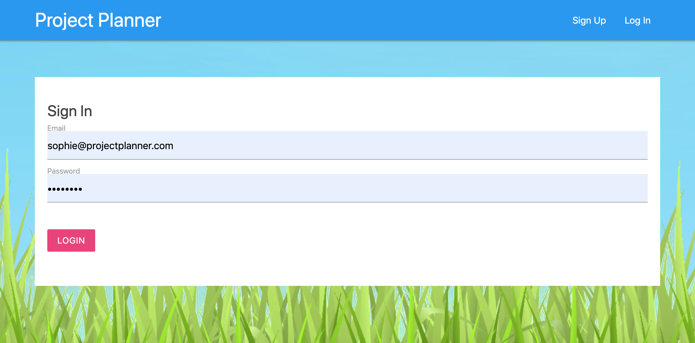
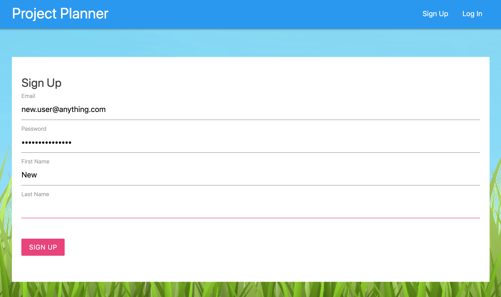
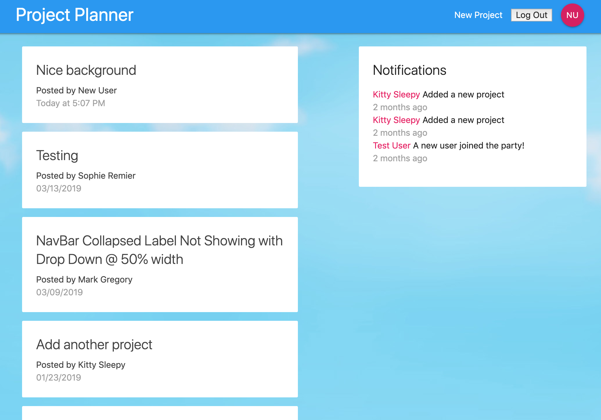

This project was bootstrapped with [Create React App](https://github.com/facebook/create-react-app).

## [DEMO](https://sp-project-planner.firebaseapp.com/)

## Screenshots:

`npm start` Runs the app in the development mode.  

Open [http://localhost:3000](http://localhost:3000) to view it in the browser.

